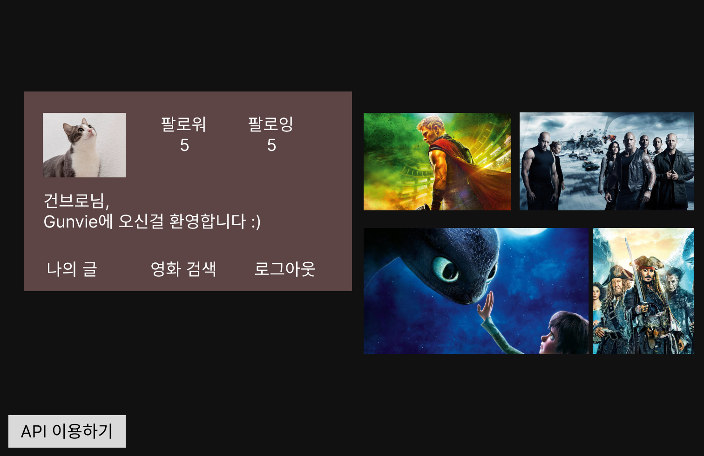
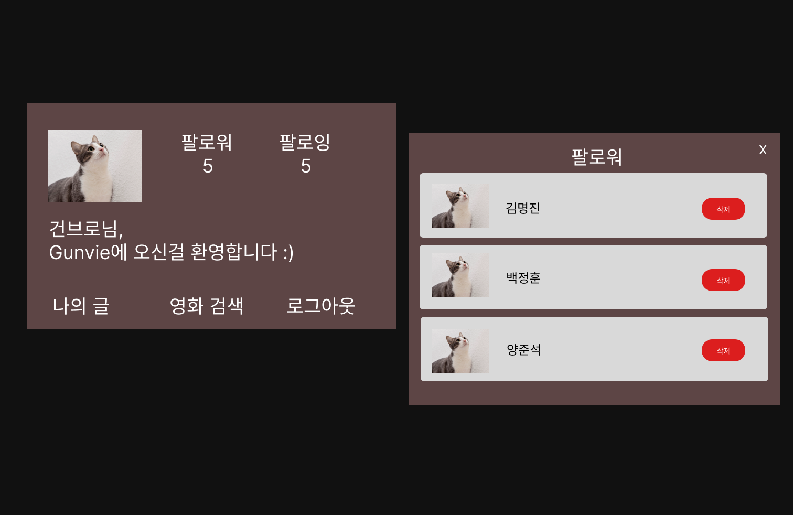
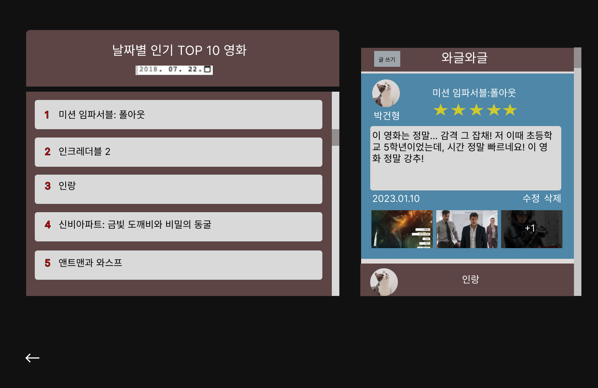
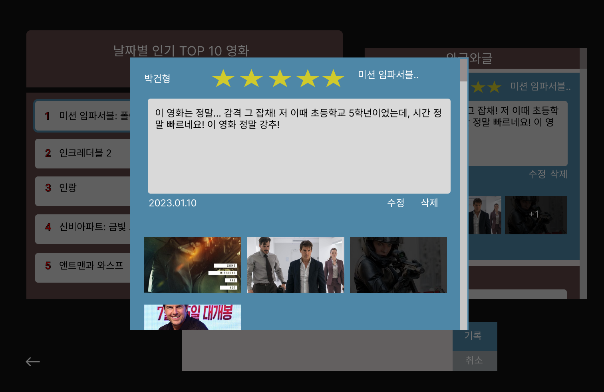
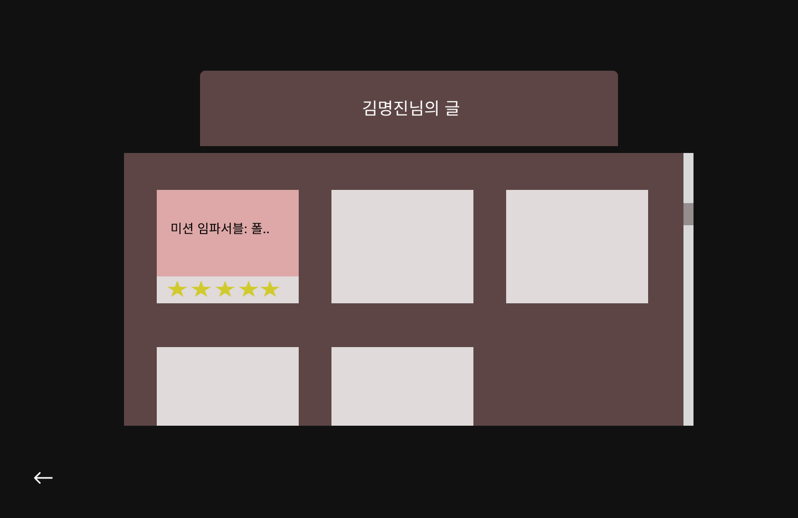
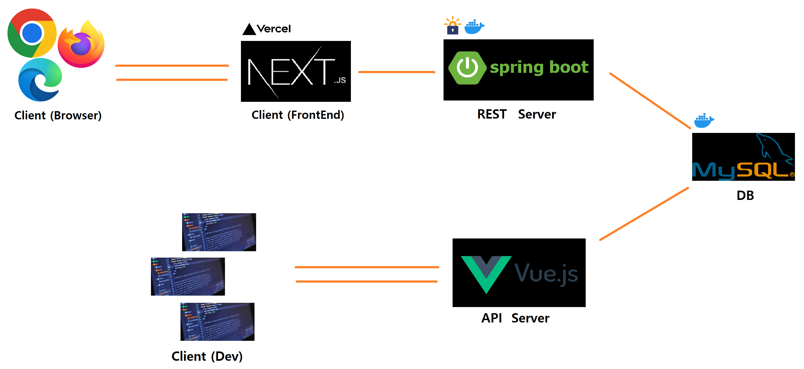
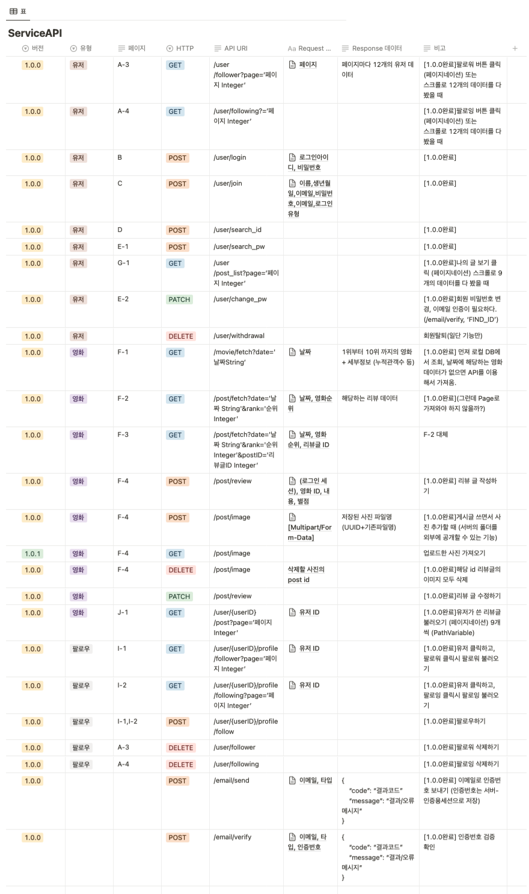
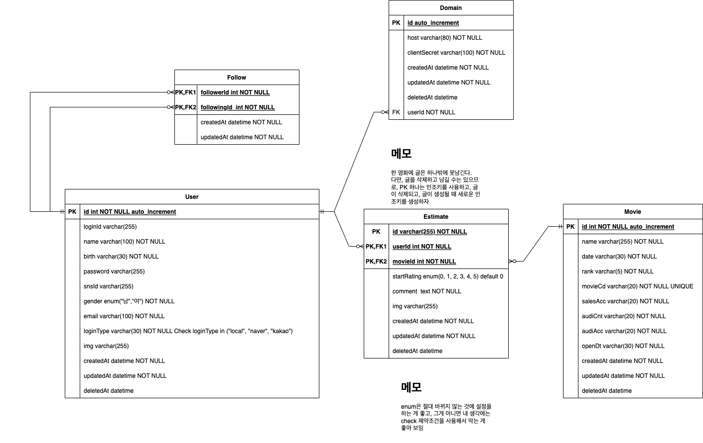
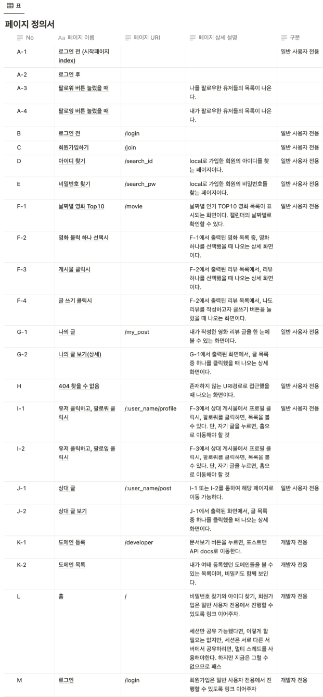

# gunvie-backend-server
> kobis OpenAPI를 이용한 영화 리뷰 웹페이지. 토이 프로젝트
- 기간 : 2023.03.01 ~ 2023.04.27 (V1.0 배포 완료, 지속 개발중)
- 팀원 : 김명진(백엔드, SpringBoot), 박건형(프론트엔드, NextJS), 공통(기획,설계,DB)

## 정보
- 이 곳은 Gunvie 프로젝트의 Backend 서버입니다.
- frontend 직접적으로 통신하는 서버.
- [gunvie-frontend Repository 바로가기](https://github.com/gun-bro98/gunvie-frontend)

## 개발 환경
- OS : Windows10 | MacBookAir 2015 12.6.5
- Server : Synology > Docker > Ubuntu
- Java : 17.0.x
- FrameWork : SpringBoot 3.0.2
- ORM : Hibernate JPA
- DB : MySQL 8.0.x
- IDE : IntelliJ

## 서버 실행방법
- 깃 리포지토리에서 해당 main 브랜치를 다운로드 한다.
- src-main-resources 폴더에, 따로 저장된 3가지 보안 파일을 넣어준다.
- application-dev.properties | application-prod.properties | keystore.p12
- properties 파일을 참조하여 DB와 SMTP등 필요한 것들을 셋팅해준다.
- 프로파일 설정이 필요하다. -Dspring.profiles.active= dev | prod
- src-main-java-com-gunbro-gunvie-GunvieApplication.class 를 들어가 실행하면 된다.
- TLS가 적용된 버전은 keystore.p12에 명시된, 도메인이 준비된 서버가 필요하다.

## 브랜치 전략
- DDingJin(Dev) >> Staging >> main

   

## 프로젝트 소개
영화 리뷰를 보고, 쓸 수 있는 게시판 형태의 웹사이트

### <과제의 개요>
OpenAPI를 사용해보고, 게시판 형태의 로그인 가능한 토이프로젝트를 만들어보기 위함.
### <과제의 목표>
- 해당하는 날짜의 영화 순위를 볼 수 있다.
- 유저는 해당 영화에 대해 리뷰를 작성할 수 있다.
- 서버가 멈추지 않고 운용 가능한 수준을 유지하여, 유저들이 우리의 서비스를 실질적으로 사용할 수 있게 끔 하는 것.
### <과제 수행방법>
Notion과 Postman을 적극 활용하여, 프론트엔드 단과 적극적인 소통을 지향하였다.
### <과제의 기대효과>
해당 프로젝트를 통하여 나의 프로그래밍 실력이 성장할 수 있음을 목표로 두며, SpringSecurity 적용과 카카오톡 로그인 같은 지속적인 기능 추가, 기존 코드리팩토링을 통하여 어느정도의 실무 실력도 오르기를 기대해봄.

## 실행 화면
- 프론트엔드 쪽에서 개발한 UI 이다.
- 현재 UI Pigma 프로토타입 ([UI 전체보기](https://www.figma.com/file/kjBB4lLbdJVonqEUTdJykN/Gunvie?node-id=0-1))
- 실제 UI는 제작중

## 서버 구성도 (좀 더 세세하게 수정 필요..)

## API 설계서

## ER 다이어그램

## 페이지 정의서

## 후기
 - 항상 짧게짧게 진행하던 연습프로젝트만 하다가, 이렇게 제대로 된 스프링부트 프로젝트를 만들어보는 것은 처음이었다.
 - 내가 어느정도 배웠다고 생각했는데, 이번 프로젝트를 통해 큰 오산이었음을 알게 되었다. 프로젝트를 진행할 때마다 배워야 할 것은 또 생긴다. 배움의 길은 끝이 없으므로, 지식을 빠르게 내 것으로 만들어서 응용할 줄 알아야 한다.
 - 그러기 위해서는 기본기가 탄탄해야 한다는 것을 뼈저리게 느꼈다. 자바 기본문법을 더 익히고, 알고리즘 공부도 병행해야겠다.
 - 실력의 부족은 곧 중복코드를 남발하는 결과를 가져왔다. 로그인 세션 공통 예외처리를 할 줄 몰라서, 각 컨트롤러마다 예외처리 로직을 전부 중복 작성해주었다..
 - 스프링 공부를 계속 해나가며, 계속해서 리팩토링을 해볼 예정이다.
 - 뿐만 아니라, 혼자서 개발했을 때는 몰랐던 점들도 알게 되었다. 깃 브랜치 전략, 깃 컨벤션 등등.. 특히 API 설계서를 다 작성한 후, 몇 주뒤 API 주소를 수정할 일이 생겼을 때가 가장 난감했다. 이제와서 내 맘대로 수정하면 분명 기분 나쁠텐데..
 - 분명 혼자서 개발할 때는 아무런 문제가 없었는데, 막상 Staging 서버를 올리고 나니 Runtime Exception 이 수도 없이 발생하였다. TDD가 얼마나 중요한지 뼈저리게 느꼈다.